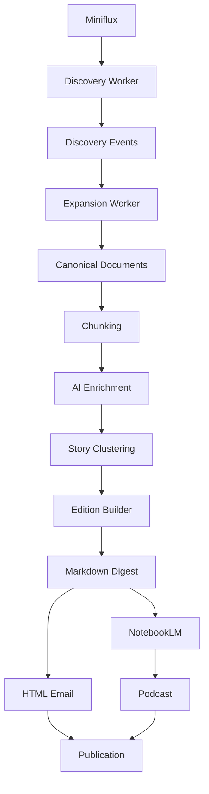
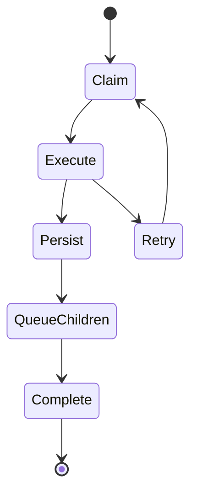
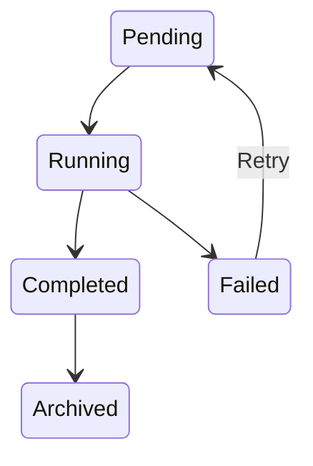
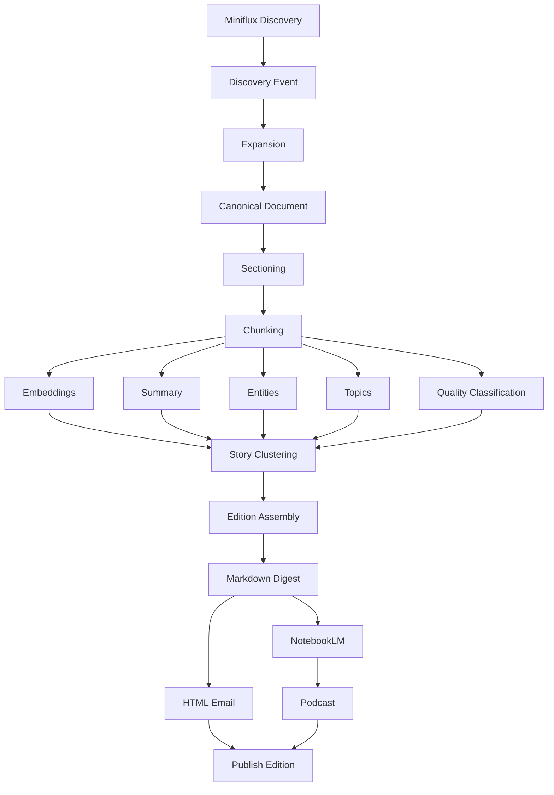
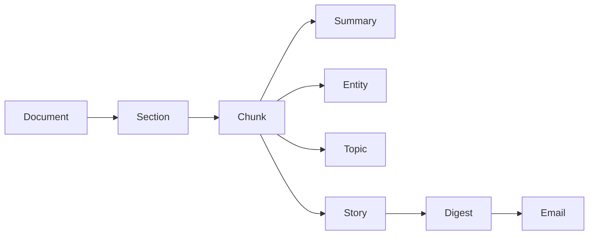
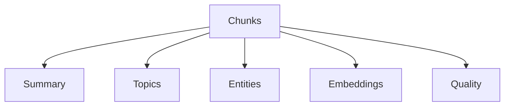
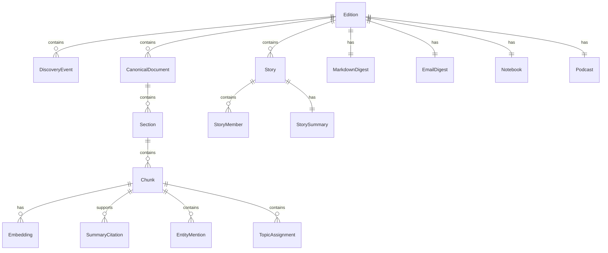
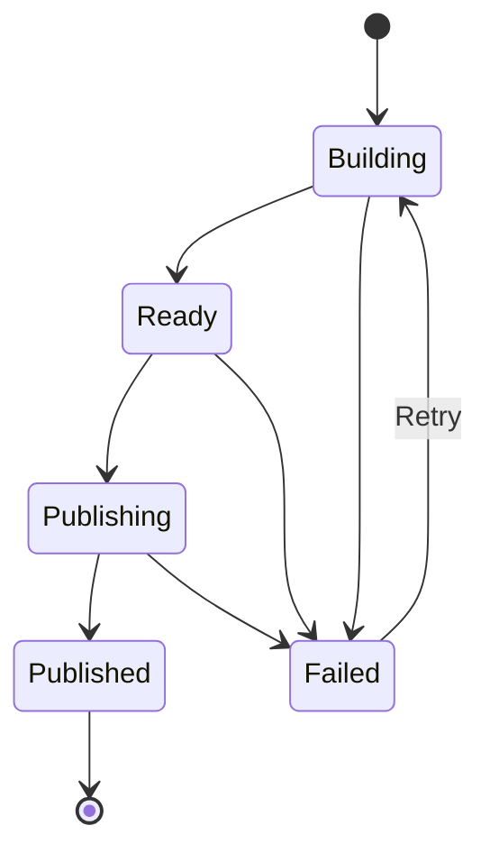
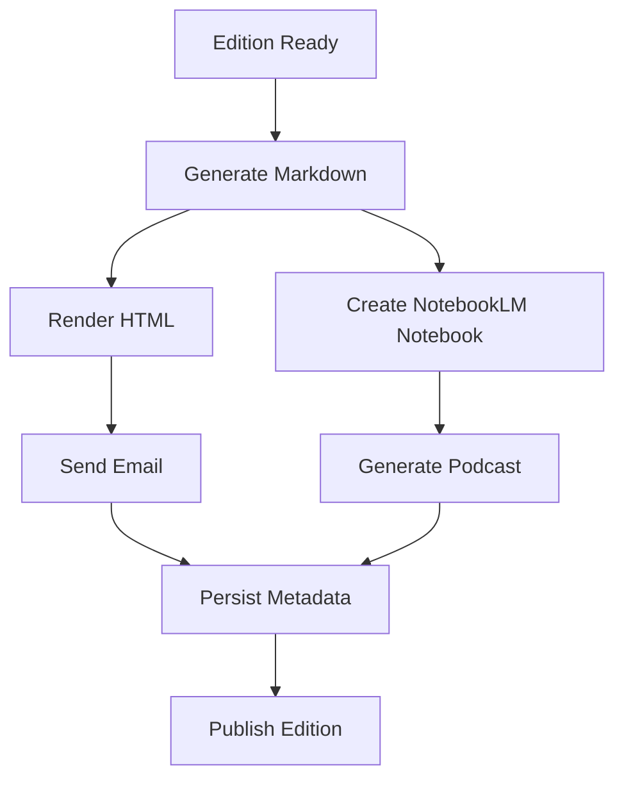

# Personal News Intelligence Pipeline (PNIP) — Implementation Specification

This document merges the three implementation handoff parts into a single
self-contained specification for an autonomous coding agent:

* **Part 1 — Architecture & System Design** (§1–14)
* **Part 2 — Pipeline, Data Model & Persistence** (§15–38)
* **Part 3 — Edition Lifecycle, Publication, Operations & Delivery** (§39–64)

Two new sections have been added to aid the handoff without altering the
architecture:

* **Glossary** — defines the core domain terms used throughout.
* **Implementation Milestones** — maps the 13 processing phases from §5 onto
  concrete, dependency-ordered development milestones.

Every section number, table, diagram, and constraint from the original three
documents is preserved unchanged.

---

# Glossary

The following terms recur throughout this specification. They are defined here
once for reference.

**Discovery Event**
The immutable record created when an unread entry is first discovered from
Miniflux and persisted in PostgreSQL. It is the boundary that transfers
ownership of processing from Miniflux to PNIP. Each DiscoveryEvent belongs to
exactly one Edition and triggers an Expansion job. Persistence precedes
marking the entry read in Miniflux, so a failed persist never loses
ownership nor creates downstream work.

**Canonical Document**
The normalized, immutable representation of a piece of content (article,
YouTube video, podcast, PDF, or Reddit submission) produced by the Expansion
stage. All downstream processing operates exclusively on canonical documents.
Corrections require creating a replacement document within a new Edition
revision; the original is never modified.

**Section**
A logical structural component of a Canonical Document (e.g. title, heading,
paragraph group, transcript segment, Reddit submission, Reddit comment, or
attachment). Sections preserve document structure independently of AI
processing. Section ordering is immutable, and each Section belongs to exactly
one Canonical Document.

**Chunk**
A deterministic processing unit derived from a Section, optimized for AI
consumption. Each chunk records text, token count, byte offsets, paragraph
range, an optional timestamp range, and a reference to its originating
section. Chunk IDs are deterministic so that downstream artifacts remain
stable across reruns. Each Chunk belongs to exactly one Section and is the
atomic unit of provenance.

**Artifact**
Any generated output that references one or more Chunks. Artifacts include
summaries, entity mentions, topic assignments, embeddings, quality
classifications, story summaries, and publication artifacts (Markdown digest,
HTML email, notebook, podcast). Every AI artifact records prompt id, prompt
version, model, provider, input hash, and creation timestamp for complete
reproducibility.

**Story**
A cluster of Canonical Documents within a single Edition that describe the
same event or topic. A document belongs to exactly one Story within an
Edition. A Story carries a master summary, citation map, timeline, and lists
of supporting and contradicting documents. Stories are Edition-scoped;
cross-Edition clustering is explicitly out of scope.

**Edition**
The primary unit of publication. An Edition is a complete, immutable snapshot
of all documents, enrichments, stories, and publication artifacts for a
publication period (normally one calendar day). Every document belongs to
exactly one Edition. An Edition progresses through Building → Ready →
Publishing → Published (with Failed as a recoverable state). Once Published,
an Edition becomes permanently read-only.

**Provenance**
The mandatory traceability chain connecting every generated claim back to one
or more source Chunks, Sections, and Canonical Documents. Provenance records
originating document, originating chunk(s), source offsets, prompt version,
model, and generation timestamp. Generated information without provenance is
considered invalid. The chain must remain navigable in both directions.

**Worker**
An independent, stateless processing unit that claims a Job from the
PostgreSQL-backed queue, executes one processing stage, persists results,
enqueues dependent jobs, and marks its job complete. Workers never invoke one
another directly; they communicate only through PostgreSQL.

**Job**
A single unit of work in the internal PostgreSQL-backed job queue. A Job has
a type, owning Edition, target entity, status, retry count, timestamps, error
metadata, and dependency information. Jobs are claimed using transactional
locking (`FOR UPDATE SKIP LOCKED`) to allow concurrent workers without
duplicate execution.

**Fabric**
The primary content extraction engine for Expansion plugins — applied to the
source types it genuinely supports. Fabric (Go CLI, v1.4.455 installed)
supports YouTube transcripts (`--youtube`), web scraping via Jina AI
(`--scrape_url`), and audio transcription (`--transcribe-file`). Verified:
`fabric -u <url>` emits raw markdown (with a Title/URL Source/Published Time
metadata header) to stdout without invoking an LLM, provided no `-p` pattern
is supplied. PDF is extracted via MarkItDown (Microsoft, v0.1.6 installed) —
a Python CLI that converts PDF and other document formats to markdown —
because Fabric has no raw PDF text path. Reddit is extracted natively
because Jina is blocked by Reddit (HTTP 403); Reddit also requires
structured comment metadata (scores, sticky/moderator flags) that scraping
cannot provide (§26). See the Expansion Plugin Extraction Map below for the
per-source assignment.

**Expansion Plugin Extraction Map**

| Source   | Engine                          | Rationale                                                                  |
| -------- | ------------------------------- | -------------------------------------------------------------------------- |
| Article  | Fabric `-u` (Jina scrape)       | Verified raw markdown + metadata; no LLM; replaces HTTP fetch + regex.      |
| YouTube  | Fabric `-y --transcript-with-timestamps` | Native transcript/timestamp/metadata support; requires `yt-dlp` on PATH.    |
| Podcast  | Fabric `--transcribe-file`      | Whisper transcription; requires OpenAI key + ffmpeg for >25MB files.        |
| PDF      | MarkItDown (Python CLI)         | Fabric has no raw PDF→text path (only LLM-routed `--attachment`).           |
| Reddit   | Native Node (Reddit API / JSON) | Jina is 403-blocked by Reddit; §26 needs structured comment metadata.       |

**pgvector**
The PostgreSQL extension used to store embedding vectors. No external vector
database is permitted; embeddings live alongside all other persistent data in
PostgreSQL, and each embedding belongs to exactly one Chunk. Embeddings are
generated locally via Transformers.js (see below) — no external embedding API
is used.

**Transformers.js**
The local embedding engine used by the Embeddings enrichment worker. Runs
Hugging Face models in-process via ONNX Runtime (Node.js) — no separate API
call or external service required. Default model: `Xenova/all-MiniLM-L6-v2`
(384-dimensional vectors). The model is downloaded and cached on first use.
This keeps embedding generation free, fast, and fully self-hosted, consistent
with the project's conservative-dependency ethos. The Vercel AI SDK remains
the abstraction for text-generation tasks (summaries, entities, topics,
quality) but embeddings use Transformers.js exclusively.

**notebooklm-py**
The Python library used to create NotebookLM notebooks and generate podcasts.
NotebookLM serves as the sole conversational interface for published Editions.
No custom RAG or chat API is implemented.

---

# Part 1 — Architecture & System Design

---

# 1. Project Overview

The Personal News Intelligence Pipeline (PNIP) is a self-hosted TypeScript application that transforms content discovered from RSS feeds into curated daily intelligence products.

Miniflux acts solely as the discovery mechanism. Once an item has been discovered and successfully persisted, all subsequent processing occurs entirely within PNIP.

The pipeline expands each discovered item into a canonical document, enriches it using AI, groups related documents into stories, and publishes a daily Edition consisting of:

* a canonical Markdown digest
* an HTML email generated from that Markdown and delivered via Resend
* a NotebookLM notebook generated through `notebooklm-py`
* a NotebookLM-generated podcast

NotebookLM is the only conversational interface. The system does not expose or implement its own retrieval-augmented generation (RAG), search, or chat API.

The architecture is intentionally designed as a deterministic processing pipeline built from independent, resumable, idempotent stages. Every generated artifact maintains complete provenance back to the original canonical source material.

---

# 2. Project Goals

The implementation must satisfy the following primary objectives.

## Reliable Content Discovery

Automatically discover unread entries from Miniflux, persist them locally, and transfer ownership of processing to PNIP.

Miniflux is treated as a discovery queue rather than a persistent processing system.

---

## Canonical Content Representation

Every supported source must be transformed into a normalized Canonical Document regardless of origin.

Supported source types include:

* Articles
* YouTube
* Podcasts
* PDFs
* Reddit

All downstream processing operates exclusively on canonical documents.

---

## End-to-End Provenance

Every generated artifact—including summaries, entities, topics, clusters, digest sections, and publication artifacts—must preserve references back to canonical document sections and chunks.

Every generated claim must be traceable to one or more source locations.

---

## Deterministic Daily Editions

Each publication day produces an Edition representing a complete immutable snapshot.

An Edition encapsulates:

* discovered documents
* canonical documents
* AI enrichments
* story clusters
* Markdown digest
* HTML email
* Notebook metadata
* podcast metadata
* prompt metadata
* lineage

After publication an Edition becomes immutable.

---

## Safe Restartability

The pipeline must tolerate interruption at any stage.

Restarting the application must never require manual cleanup.

Previously completed work must never be repeated unless explicitly requested.

---

# 3. Core Architectural Principles

These principles govern every implementation decision.

## 3.1 Discovery is Separate from Processing

Miniflux owns feed subscriptions.

PNIP owns all processing after successful persistence.

```
Miniflux

↓

Unread Entry

↓

Persist Discovery

↓

Mark Read

↓

PNIP owns lifecycle
```

The system must never revisit Miniflux history.

---

## 3.2 Canonical Documents are Immutable

Expansion produces a Canonical Document.

Once stored, canonical content is never modified.

Later processing creates new artifacts rather than altering the document.

```
Discovery

↓

Expansion

↓

Canonical Document

↓

Read-only forever
```

---

## 3.3 Downstream Stages Never Mutate Upstream Data

Each processing stage creates additional data.

It never edits existing data.

For example:

```
Canonical Document

↓

Chunks

↓

Embeddings

↓

Summary

↓

Story Cluster

↓

Digest
```

Each artifact references earlier artifacts but never overwrites them.

---

## 3.4 Provenance is Mandatory

Every generated statement must record:

* originating document
* originating chunk(s)
* source offsets
* prompt version
* model
* generation timestamp

Generated information without provenance is considered invalid.

---

## 3.5 Idempotency

Every worker must produce identical persistent state when rerun against identical inputs.

Running a completed stage again should either:

* detect completion and exit, or
* replace only artifacts owned by that stage.

No worker may duplicate records.

---

## 3.6 Edition Immutability

An Edition transitions through defined lifecycle states.

Only Editions in Building or Ready states may change.

Published Editions become permanently read-only.

---

## 3.7 Single Persistent Datastore

PostgreSQL is the only persistent datastore.

It stores:

* discovery events
* canonical documents
* AI artifacts
* embeddings
* editions
* jobs
* prompts
* lineage
* publication artifacts

No additional databases may be introduced.

---

# 4. Mandatory Design Decisions

The following architectural decisions are fixed requirements.

| Area                    | Decision                             |
| ----------------------- | ------------------------------------ |
| Language                | TypeScript                           |
| Runtime                 | Node.js                              |
| Feed Discovery          | Miniflux                             |
| Extraction Engine       | Fabric (Article/YouTube/Podcast) + MarkItDown (PDF) + native (Reddit) |
| AI Provider Abstraction | Vercel AI SDK or Opencode/PI         |
| Storage                 | PostgreSQL                           |
| Embeddings              | Transformers.js (generation) + pgvector (storage) |
| Email Delivery          | Resend                               |
| Notebook Generation     | notebooklm-py                        |
| Podcast Generation      | NotebookLM via notebooklm-py         |
| Digest Format           | Markdown                             |
| HTML Generation         | Markdown → HTML                      |
| Conversation Interface  | NotebookLM                           |
| Workflow                | Internal PostgreSQL-backed job queue |
| Orchestration           | Internal workers only                |

These decisions are implementation constraints rather than suggestions.

---

# 5. High-Level System Architecture



Every node represents an independent processing stage.

Each stage communicates exclusively through PostgreSQL.

Workers never invoke downstream workers directly.

Instead they enqueue jobs.

---

# 6. Processing Model

The application is event-driven but database-coordinated.

Each worker:

1. claims a pending job
2. executes one processing stage
3. commits results
4. schedules dependent jobs
5. marks its job complete

No worker contains knowledge of the complete pipeline.

Instead each worker is responsible only for:

* validating prerequisites
* executing its stage
* creating downstream work

This minimizes coupling and simplifies recovery.

---

# 7. Project Structure

The repository should be organized by domain rather than processing phase.

```
src/

    cli/                      # CLI commands + worker runtime wiring
    config/                   # env-driven configuration + validation
    logging/                  # structured JSON logger

    database/
        migrations/           # forward-only SQL migrations
        kysely.ts             # typed schema (no separate schema/ or repositories/ dirs)

    jobs/
        queue/                # PostgreSQL-backed ProcessingJobQueue
        workers/              # generic Worker interface + worker-runtime

    discovery/                # Miniflux client, DiscoveryRepository, DiscoveryService
    expansion/                # DocumentRepository, SectionRepository, plugins, expand worker
        # NB: no separate canonical/ dir — DocumentRepository + SectionRepository live
        # under expansion/ because they are produced exclusively by the expansion stage.
        # NB: plugins live directly in src/expansion/, not in a plugins/ subdir.

    chunking/                 # ChunkRepository, chunking-service, chunk_document worker

    enrichment/
        summary/              # SummaryRepository + SummarizeChunkWorker
        entities/             # EntityRepository + ExtractEntitiesWorker
        topics/               # TopicRepository + AssignTopicsWorker
        embeddings/           # EmbeddingRepository + EmbedChunkWorker
        quality/              # QualityRepository + ClassifyQualityWorker

    clustering/               # (M5) Story clustering

    editions/                 # EditionRepository (state machine)

    digest/
        markdown/             # (M7) Markdown digest
        html/                 # (M8) HTML email rendering

    notebooklm/               # (M9) NotebookLM notebook creation
    podcast/                  # (M10) NotebookLM podcast generation
    publication/              # (M11) Edition publication coordination

    provenance/               # shared document_lineage graph
    prompts/                  # PromptRepository + seedDefaultPrompts()

    ai/                       # AiProvider (text) + EmbeddingProvider (vectors) + prompt execution
    common/                   # shared helpers (json-extract, vector-codec)
```

Supporting directories:

```
docs/                        # implementation specification (PLAN.md)
```

Each directory exposes a well-defined public interface.

Cross-domain dependencies should be minimized.

### Repository organization

Repositories live next to the workers that own them, not in a shared
`src/database/repositories/` directory. For example:

* `DocumentRepository` and `SectionRepository` live in `src/expansion/` because
  the expansion stage is the sole writer.
* `ChunkRepository` lives in `src/chunking/`.
* `SummaryRepository` lives in `src/enrichment/summary/`.

This co-location makes the "this worker owns these rows" boundary visible at
the file level. The shared `src/database/kysely.ts` is the only place that
defines table types, and every repository imports from it.

### Job lifecycle

There is no separate `src/jobs/scheduler/` directory. The runtime loop in
`src/cli/index.ts` calls `workerRuntime.runOne(workerId)` in a `while` loop
until the queue is empty. Job claiming, retry, dependency tracking, and
archival are encapsulated in `ProcessingJobQueue` and `worker-runtime`.

---

# 8. Module Boundaries

The application is divided into cohesive modules.

## Discovery

Responsible only for communication with Miniflux.

Never performs extraction.

---

## Expansion

Transforms URLs into canonical documents.

Owns plugin selection.

Uses Fabric for Article, YouTube, and Podcast; MarkItDown for PDF; native extraction for Reddit.

Owns document and section persistence (`DocumentRepository`,
`SectionRepository`) — there is no separate `Canonical` directory; the
canonical document is the immediate output of expansion, so its persistence
lives here.

---

## Canonical

A logical role, not a separate directory. The canonical document model is
the central data object produced by Expansion (§20) and persisted by
`DocumentRepository` + `SectionRepository` in `src/expansion/`.

Owns immutable document storage.

Provides read APIs.

Never performs AI work.

---

## Chunking

Creates deterministic document chunks.

Calculates offsets.

Creates provenance mappings.

---

## Enrichment

Produces AI-derived artifacts.

Examples:

* summaries
* entities
* topics
* embeddings
* quality classifications

---

## Clustering

Groups documents into stories.

Produces story-level summaries.

---

## Editions

Owns Edition lifecycle.

Tracks publication state.

Controls immutability.

---

## Digest

Produces Markdown.

Renders HTML.

Owns citation formatting.

---

## NotebookLM

Uploads sources.

Creates notebooks.

Stores metadata.

---

## Publication

Coordinates final publication.

Transitions Editions to Published.

Cancels remaining mutable work.

---

## Provenance

Shared infrastructure used by every AI stage.

Responsible for lineage graph construction and citation resolution.

---

## AI

Central provider abstraction for text generation.

Owns:

* model selection (Vercel AI SDK)
* retries
* prompt execution
* prompt metadata recording

Embeddings are generated separately via Transformers.js (ONNX in-process
inference) — they do not use this abstraction.

No business logic belongs here.

---

# 9. Internal Worker Framework

Processing is performed by independent workers.

Every worker follows the same lifecycle.



Workers never invoke one another directly.

Instead they create downstream jobs.

This guarantees resumability and loose coupling.

---

# 10. Worker Contract

Every worker implements the same logical interface.

```text
interface Worker<TJob> {

    supports(jobType)

    execute(job)

}
```

Execution flow:

```
Load Job

↓

Validate Inputs

↓

Acquire Transaction

↓

Execute Stage

↓

Persist Outputs

↓

Enqueue Child Jobs

↓

Commit

↓

Mark Complete
```

Any failure causes transaction rollback.

No partial outputs should remain visible.

---

# 11. Job Queue Architecture

The internal queue is implemented entirely in PostgreSQL.

Each job represents exactly one unit of work.

A job contains:

* unique identifier
* job type
* owning Edition
* target entity
* current status
* retry count
* timestamps
* error metadata
* dependency information

Workers poll for claimable jobs using transactional locking (for example, `FOR UPDATE SKIP LOCKED`) to allow multiple worker processes without duplicate execution.

Job lifecycle:



Workers may execute concurrently provided they do not claim the same job.

---

# 12. Configuration

Configuration is supplied exclusively through environment variables.

Configuration domains include:

* PostgreSQL
* Miniflux
* AI providers
* Resend
* notebooklm-py
* logging
* worker concurrency
* retry policies
* Reddit enrichment
* Edition scheduling

Configuration should be validated during application startup.

Startup must fail fast if required configuration is missing or invalid.

No processing should begin with an invalid configuration.

---

# 13. Logging

All logs should be structured JSON.

Every log record should include, where applicable:

* timestamp
* log level
* worker name
* job identifier
* Edition identifier
* document identifier
* processing stage
* execution duration
* correlation identifier

Errors should always include structured diagnostic information rather than free-form stack traces alone.

Logging should make it possible to reconstruct the complete lifecycle of any document or Edition from discovery through publication.

---

# 14. Architectural Constraints

The following constraints apply throughout the implementation.

* Miniflux is discovery only.
* Fabric is the primary content extraction engine (Article, YouTube, Podcast); MarkItDown for PDF; native extraction for Reddit (see Expansion Plugin Extraction Map).
* PostgreSQL is the only persistent datastore.
* pgvector stores embeddings.
* Resend sends email.
* `notebooklm-py` creates NotebookLM notebooks and podcasts.
* NotebookLM is the conversational interface.
* No custom RAG or chat API may be implemented.
* No external workflow engines may be introduced.
* Markdown is the canonical digest format.
* HTML email is generated from Markdown.
* Editions become immutable after publication.
* Every AI artifact records prompt and model metadata.
* Every generated claim preserves provenance to canonical source material.
* Every processing stage is idempotent.
* The pipeline is resumable after interruption.

These constraints take precedence over implementation convenience and should be treated as invariant throughout the codebase.

---

# Part 2 — Pipeline, Data Model & Persistence

---

# 15. End-to-End Processing Pipeline

The pipeline is a directed acyclic graph (DAG) of independent, idempotent processing stages. Each stage consumes persisted data, produces new persisted artifacts, and schedules downstream work. Workers communicate only through PostgreSQL.



Each node represents a durable checkpoint.

No stage relies on in-memory state from a previous stage.

---

# 16. Stage Responsibilities

## Discovery

Inputs

* unread Miniflux entries

Outputs

* DiscoveryEvent
* ExpandDocument job

Discovery ends immediately after persistence and successful acknowledgement to Miniflux.

---

## Expansion

Inputs

* DiscoveryEvent

Outputs

* CanonicalDocument
* Expansion metadata
* Section records
* ChunkDocument job

Expansion owns content acquisition.

No downstream stage performs extraction.

---

## Sectioning

Expansion produces logical document sections before chunking.

Typical sections include:

* Title
* Introduction
* Headings
* Paragraph groups
* Transcript segments
* Reddit comments
* Attachments

Sections preserve document structure independently of AI processing.

---

## Chunking

Chunking converts sections into deterministic processing units.

Chunk boundaries should remain stable across repeated executions.

Each chunk records:

* text
* token count
* byte offsets
* paragraph range
* timestamp range (if applicable)
* originating section
* document version

Chunk IDs should be deterministic so downstream artifacts remain stable.

---

## AI Enrichment

Each enrichment worker operates independently.

No enrichment worker depends on another enrichment output unless explicitly required.

Workers include:

* Summary
* Entities
* Topics
* Embeddings — Transformers.js ONNX in-process inference; no external embedding API
* Quality Classification

Failures in one enrichment worker do not prevent successful completion of others.

---

## Story Clustering

Consumes:

* canonical documents
* summaries
* embeddings
* topics

Produces:

* Story
* Cluster membership
* Story summary
* Citation map

Story clusters never modify document-level enrichments.

---

## Edition Assembly

Collects all completed stories belonging to the active Edition.

Produces deterministic ordering.

Validates completeness before artifact generation.

---

## Publication Artifact Generation

Artifact generation occurs in this order:

```
Markdown

↓

HTML

↓

NotebookLM

↓

Podcast
```

Markdown remains the canonical representation.

All other artifacts derive from it or from Edition source documents.

---

## Publication

Publication finalizes the Edition.

No additional processing is permitted afterward.

Any unfinished mutable jobs are cancelled.

---

# 17. Discovery Model

Discovery exists solely to transfer ownership from Miniflux into PNIP.

```text
Unread Entry

↓

Persist DiscoveryEvent

↓

Commit

↓

Mark Read

↓

Queue Expansion
```

If persistence fails:

* entry remains unread
* no downstream work exists

If marking read fails:

* retry acknowledgement
* never duplicate DiscoveryEvent

DiscoveryEvent represents the immutable record of ingestion.

---

# 18. Expansion Architecture

Expansion transforms a URL into a Canonical Document.

Expansion always proceeds through a plugin.

```text
URL

↓

Plugin Selection

↓

Content Extraction
(Fabric `-u` / `-y` / `--transcribe-file`; MarkItDown for PDF; native for Reddit)

↓

Normalization

↓

Canonical Document
```

Fabric is the default extraction engine for Article (`-u`), YouTube (`-y`),
and Podcast (`--transcribe-file`). PDF uses MarkItDown (Fabric has no raw
PDF path); Reddit uses native extraction. See the Expansion Plugin
Extraction Map in the Glossary for the per-source assignment and rationale.

---

# 19. Expansion Plugin Interface

Each plugin implements a common interface.

```text
interface ExpansionPlugin {

    supports(url)

    expand(context)

}
```

Responsibilities include:

* URL recognition
* content extraction (Fabric or native, per the Extraction Map)
* metadata normalization
* attachment discovery
* provenance mapping

Plugins must not:

* perform AI enrichment
* create embeddings
* summarize content
* cluster stories

Supported plugins:

* Article
* YouTube
* Podcast
* PDF
* Reddit

Plugin selection is deterministic.

The first matching plugin is used.

---

# 20. Canonical Document Model

The Canonical Document is the central data object within PNIP.

Every downstream artifact references it.

```text
CanonicalDocument

id

edition_id

source_type

source_url

canonical_url

title

subtitle

authors

publisher

published_at

language

markdown            # SQL: content_markdown
plain_text          # SQL: content_text

metadata

created_at
```

The conceptual model uses short names (`markdown`, `plain_text`); the SQL
columns in `documents` are `content_markdown` and `content_text` to avoid
collisions with the JSON `metadata` field. Repositories abstract this.

The document is immutable.

Corrections require creation of a replacement document within a new Edition revision.

---

# 21. Document Structure

A document consists of hierarchical components.

```text
Document

↓

Sections

↓

Chunks

↓

Lineage
```

Example:

```
Document

├── Introduction

├── Section

│     ├── Chunk

│     ├── Chunk

│

├── Section

│     ├── Chunk

│

└── Attachments
```

This hierarchy allows provenance at multiple levels.

---

# 22. Section Model

Sections represent logical structure.

Fields:

```text
Section

id

document_id

order                # SQL: section_order
heading

type                 # SQL: section_type
markdown             # SQL: content_markdown
plain_text           # SQL: content_text

metadata
```

Conceptual field names use short forms (`order`, `type`, `markdown`,
`plain_text`); SQL columns are `section_order`, `section_type`,
`content_markdown`, `content_text`. Repositories abstract this.

Section types may include:

* title
* heading
* paragraph
* transcript
* reddit_submission
* reddit_comment
* attachment

Section ordering is immutable.

---

# 23. Chunk Model

Chunks are optimized for AI processing.

```text
Chunk

id

document_id

section_id

sequence

text

token_count

start_offset

end_offset

paragraph_start

paragraph_end

timestamp_start

timestamp_end
```

Chunk boundaries must be deterministic.

Given identical document content, chunk IDs should not change.

---

# 24. Provenance Model

Every generated artifact references one or more chunks.

No AI output exists without provenance.



This chain must remain navigable in both directions.

---

# 25. Citation Model

Generated claims never reference documents directly.

Instead they reference supporting chunks.

```
Claim

↓

Chunk IDs

↓

Section

↓

Document

↓

Original Source
```

Multiple chunks may support a single claim.

One chunk may support multiple claims.

---

# 26. Reddit Expansion

Reddit differs from other source types because the extraction source is an
Atom RSS feed (Reddit JSON API is 403-blocked by Reddit for Jina-scraped
URLs, and Reddit requires structured comment metadata — scores, sticky and
moderator flags — that scraping cannot provide).

Initial expansion captures:

* submission (title, body, author, score, subreddit, created timestamp)
* top-N comments via the initial RSS fetch

To keep chunks tractable on threads with hundreds of comments, the initial
expansion caps the comment set at 25 using the top-N strategy in
`selectComments` (`src/expansion/comment-selection.ts`). The plugin does not
perform any further comment fetching: the Edition contains whatever the
initial RSS fetch returned.

Comment refresh is **not** performed. The refresh infrastructure
(30m / 2h / 6h schedule, dedup, top-N selection) was retired because
Reddit's RSS rate limit (~1 req/50s, ~1,700 req/day) makes timed refresh
infeasible across hundreds of threads/day — hundreds of threads × four
fetches each far exceeds the daily budget. If a higher-rate Reddit access
method becomes available in the future, refresh can be reintroduced as a
new worker without changing the schema (sections already support an
append-only `reddit_comment` model).

---

# 27. AI Enrichment Architecture

Each enrichment stage owns one artifact type.

Workers execute independently.



Workers do not invoke one another.

Dependencies exist only through persisted data.

---

# 28. AI Artifact Model

Every generated artifact records identical metadata.

```text
Artifact

id

document_id            # denormalized for queries
chunk_id               # per-chunk granularity (see M4)

artifact_type

content

prompt_id

prompt_version

model

provider

input_hash

created_at
```

The conceptual model shows `document_id` because the original spec described
artifacts at the document level. The implementation scopes every enrichment
artifact to a **chunk** (with `document_id` denormalized for queries) — the
chunk_document_worker dispatches one enrichment job per chunk, and
`replaceForChunk()` is the idempotent boundary. The per-chunk design is
documented in the M4 section; the artifact metadata columns above are
unchanged.

The metadata provides complete reproducibility.

---

# 29. Prompt Versioning

Prompts are versioned independently from code.

Each prompt record stores:

```text
Prompt

id

name

version

template

purpose

created_at
```

Artifacts reference immutable prompt versions.

Changing a prompt creates a new version rather than modifying an existing one.

---

# 30. Embedding Model

Embeddings are generated only after chunking.

Each embedding belongs to exactly one chunk.

```
Chunk

↓

Embedding
```

Embeddings are generated locally via Transformers.js (`@xenova/transformers` or
`@huggingface/transformers`) running ONNX models in-process — no external API
call is required. The worker is an independent enrichment stage (see M4) that
performs inference using a pre-downloaded ONNX model (default:
`Xenova/all-MiniLM-L6-v2`, 384-dimensional vectors).

Embeddings are stored in PostgreSQL using pgvector.

No external vector database is permitted.

---

# 31. Story Clustering

Story clustering groups documents describing the same event.

Inputs:

* summaries
* embeddings
* topics
* document metadata

Outputs:

```text
Story

Master Summary

Citation Map

Timeline

Supporting Documents

Contradicting Documents
```

Story clusters remain Edition-scoped.

Cross-Edition clustering is explicitly out of scope.

---

# 32. Story Membership

A document belongs to exactly one Story within an Edition.

```text
Edition

↓

Story

↓

Documents
```

Membership changes are permitted only while the Edition is mutable.

---

# 33. Story Summary Provenance

Story summaries reference supporting document chunks.

```
Story Summary

↓

Claims

↓

Chunk IDs

↓

Documents
```

Story summaries never cite other summaries.

They always cite original source material.

---

# 34. Data Relationships



---

# 35. PostgreSQL Schema

The implementation should define the following primary tables.

```
editions

processing_jobs

discovery_events

documents

document_sections

document_chunks

document_lineage

summaries

summary_citations

entities

entity_mentions

topics

topic_assignments

quality_classifications

embeddings

story_clusters

cluster_members

story_summaries

story_summary_citations

markdown_digests

email_digests

notebooks

podcasts

prompt_versions
```

Supporting lookup tables may be added where they simplify normalization, but PostgreSQL remains the sole persistent datastore.

---

# 36. Repository Interfaces

Each module exposes repositories rather than direct SQL access.

Representative interfaces include:

```text
EditionRepository

DiscoveryRepository

DocumentRepository

ChunkRepository

EmbeddingRepository

SummaryRepository

StoryRepository

DigestRepository

NotebookRepository

PodcastRepository

JobRepository
```

Repositories own persistence.

Business logic belongs in workers and domain services, not repositories.

---

# 37. Transaction Boundaries

Each processing stage executes within a single database transaction wherever practical.

The transaction includes:

* validation
* writes owned by the stage
* downstream job creation
* stage completion

External network calls (Fabric, AI providers, Resend, NotebookLM, Miniflux) should occur outside long-running database transactions. Results are validated and then persisted atomically in a short transaction to avoid lock contention.

A worker either:

* commits all owned outputs, or
* commits none.

Partial stage completion is not permitted.

---

# 38. Pipeline Invariants

The following invariants must hold throughout processing:

* Every DiscoveryEvent belongs to exactly one Edition.
* Every CanonicalDocument originates from exactly one DiscoveryEvent.
* Every Section belongs to exactly one CanonicalDocument.
* Every Chunk belongs to exactly one Section.
* Every Embedding belongs to exactly one Chunk.
* Every AI artifact records prompt and model metadata.
* Every generated claim references one or more Chunks.
* Every Document belongs to exactly one Story within an Edition.
* Every Story belongs to exactly one Edition.
* Every publication artifact belongs to exactly one Edition.
* No published Edition may be modified.
* No downstream stage mutates upstream data.

These invariants define the persistent state of the system and should be enforced through database constraints, transactional worker behavior, and comprehensive automated tests.

---

# Part 3 — Edition Lifecycle, Publication, Operations & Delivery

---

# 39. Edition Lifecycle

The Edition is the primary unit of publication.

An Edition represents a complete, immutable snapshot of all documents, enrichments, stories, and publication artifacts for a publication period (normally one calendar day).

Every document belongs to exactly one Edition.

An Edition progresses through a well-defined state machine.



The Edition state is authoritative.

Workers must consult the current Edition state before performing any mutation.

---

# 40. Edition States

## Building

The Edition is accepting newly discovered documents.

Expansion, enrichment, Reddit refreshes, clustering, and other mutable processing continue normally.

All worker types are permitted.

---

## Ready

Discovery for the publication window has ended.

All required document processing has completed.

Only publication artifacts remain to be generated.

No new discovery events may be added.

---

## Publishing

Publication artifacts are being generated.

This includes:

* Markdown digest
* HTML email
* NotebookLM notebook
* NotebookLM podcast

The Edition remains mutable only for publication metadata.

Document-level processing is frozen.

---

## Published

Publication has completed successfully.

The Edition becomes immutable.

No worker may:

* modify documents
* regenerate enrichments
* recluster stories
* refresh Reddit comments
* regenerate publication artifacts

The Edition serves as the permanent archive.

---

## Failed

A recoverable failure occurred.

The Edition may be resumed after the underlying problem is corrected.

Previously completed work is preserved.

---

# 41. Edition Transition Rules

| Transition                  | Allowed | Notes                                |
| --------------------------- | ------- | ------------------------------------ |
| Building → Ready            | ✓       | All required processing complete     |
| Ready → Publishing          | ✓       | Publication begins                   |
| Publishing → Published      | ✓       | All artifacts successfully generated |
| Any Mutable State → Failed  | ✓       | Recoverable failure                  |
| Failed → Building           | ✓       | Resume processing                    |
| Published → Any Other State | ✗       | Published editions are immutable     |

State transitions should occur within database transactions to prevent race conditions.

---

# 42. Publication Pipeline

Publication executes in a fixed sequence.



Markdown is the canonical publication artifact.

Every subsequent artifact derives either directly or indirectly from the Markdown digest and Edition source documents.

---

# 43. Markdown Digest

Markdown is the canonical published representation.

The digest should be deterministic.

Given identical Edition contents, identical Markdown should be produced.

Suggested structure:

```text
Title

Table of Contents

Executive Summary

Top Stories

Technology

Politics

Science

Business

Interesting Reads

Videos

Reddit Discussions

Closing Summary

Sources
```

Every generated claim must include citations to canonical source chunks.

---

# 44. Citation Rendering

Internally, citations reference chunk identifiers.

During Markdown generation, these are resolved into reader-friendly citations.

For example:

```text
[1]

↓

Document

↓

Section

↓

Source URL
```

Citation numbering should be deterministic.

---

# 45. HTML Email Generation

Markdown is transformed into HTML.

No independent HTML authoring process exists.

Pipeline:

```text
Markdown

↓

Markdown Renderer

↓

HTML Template

↓

Resend API
```

The HTML template is responsible only for presentation.

Content must originate exclusively from Markdown.

Suggested email structure:

* header
* publication date
* table of contents
* story summaries
* expandable sections (where supported)
* citations
* notebook link
* podcast link
* footer

---

# 46. Email Delivery

Resend is the exclusive email provider.

The system records:

* delivery attempt
* provider response
* delivery status
* timestamp

The email itself is considered transient.

Markdown remains the permanent archive.

---

# 47. NotebookLM Generation

Notebook creation uses `notebooklm-py`.

Workflow:

```text
Edition

↓

Curated Source Documents

↓

Markdown Digest

↓

Upload

↓

Notebook Creation

↓

Persist Metadata
```

Stored metadata includes:

* notebook identifier
* notebook URL
* creation timestamp
* Edition identifier

NotebookLM is the conversational interface for published Editions.

No custom conversational functionality should be implemented.

---

# 48. Podcast Generation

Podcast generation also uses `notebooklm-py`.

Workflow:

```text
Notebook

↓

NotebookLM

↓

Podcast

↓

Persist Metadata
```

Stored metadata includes:

* podcast URL
* duration
* generation timestamp
* notebook identifier
* Edition identifier

The generated podcast link should be included in the published digest where available.

---

# 49. Publication Completion

Publication completes only when:

* Markdown exists
* HTML email has been successfully sent
* Notebook metadata has been stored
* Podcast metadata has been stored

After successful completion:

* Edition state becomes Published
* Reddit refresh jobs are cancelled
* remaining mutable jobs are cancelled
* processing becomes read-only

---

# 50. Failure Recovery

Failures are isolated to individual processing stages.

A failed worker does not invalidate successfully completed work.

Recovery follows this model:

```mermaid
flowchart TD

Failure

↓

Record Error

↓

Increment Retry Count

↓

Backoff

↓

Retry

↓

Success OR Permanent Failure
```

Recovery always resumes from persisted state.

No manual replay of completed stages should be necessary.

---

# 51. Retry Behaviour

Each job maintains:

* retry count
* last failure
* last attempt
* next eligible execution time

Retries should use exponential backoff with jitter to reduce contention.

Suggested default policy:

| Attempt | Delay      |
| ------- | ---------- |
| 1       | Immediate  |
| 2       | 30 seconds |
| 3       | 2 minutes  |
| 4       | 10 minutes |
| 5       | 30 minutes |

Retry limits should be configurable.

Permanent failures require operator intervention before retry.

---

# 52. Failure Isolation

Workers own only their own outputs.

Examples:

A failed Summary worker must not:

* delete embeddings
* remove chunks
* modify canonical documents

A failed Story worker must not:

* invalidate summaries
* regenerate documents

A failed Email worker must not:

* regenerate Markdown

Each worker is responsible only for artifacts it owns.

---

# 53. Idempotency Guarantees

Every processing stage must satisfy the following contract.

Running the same job multiple times produces the same persistent state.

Examples:

Discovery

* duplicate discovery events are impossible

Expansion

* canonical document is not recreated

Chunking

* identical chunk identifiers

Embedding

* replaces only owned embedding records

Summary

* replaces only summary artifacts

Digest

* deterministic output

Notebook

* does not create duplicate notebook records for the same Edition

Podcast

* does not create duplicate podcast records for the same Edition

Publication

* Published Edition cannot be republished accidentally

---

# 54. Operational Behaviour

Workers are designed for horizontal scalability.

Multiple worker processes may execute concurrently.

Concurrency safety relies on transactional job claiming.

Workers should remain stateless.

Persistent state belongs exclusively in PostgreSQL.

Application startup sequence:

```text
Validate Configuration

↓

Connect PostgreSQL

↓

Run Pending Migrations

↓

Initialize Services

↓

Start Workers (loop calls worker-runtime.runOne until queue drains)
```

The "scheduler" is not a separate process — the runtime loop in
`src/cli/index.ts` calls `workerRuntime.runOne(workerId)` in a `while`
until the queue is empty. Job claiming, retry, dependency tracking, and
archival are encapsulated in `ProcessingJobQueue` and the
`worker-runtime`. M12 may add a multi-process scheduler that fans out N
concurrent workers per CLI process, but the queue/runtime contract is
unchanged.

If any mandatory dependency is unavailable during startup, the application should fail fast.

---

# 55. Configuration

Configuration is environment-driven.

Configuration categories include:

* PostgreSQL
* Miniflux
* AI provider credentials
* Fabric configuration
* Resend credentials
* notebooklm-py configuration
* Edition scheduling
* Reddit enrichment
* worker concurrency
* retry policy
* logging

Configuration validation occurs during startup.

Invalid configuration prevents execution.

---

# 56. Database Migrations

Database schema changes are managed through versioned migrations.

Migration requirements:

* deterministic
* transactional where supported
* forward-only
* repeatable in clean environments

Application startup should verify that the database schema is current before workers begin processing.

---

# 57. Logging

Logging should be structured JSON.

Every significant operation should emit:

* timestamp
* level
* worker
* job identifier
* Edition identifier
* document identifier (when applicable)
* correlation identifier
* execution duration

Failures should include:

* exception type
* retry count
* stack trace
* external provider metadata (where available)

Logs should support complete reconstruction of an Edition lifecycle.

---

# 58. Metrics

Although no external observability platform is required, the application should maintain internal operational metrics including:

* jobs completed
* jobs failed
* retry counts
* worker throughput
* queue depth
* processing latency
* publication duration
* Edition completion time

These metrics may initially be exposed through the CLI or structured logs.

---

# 59. CLI

The CLI is the primary operational interface.

```
digestive discover
```

Runs Miniflux discovery.

---

```
digestive process
```

Runs all workers until the queue is empty.

---

```
digestive generate-edition
```

Transitions the active Edition toward publication readiness.

---

```
digestive generate-digest
```

Generates the Markdown digest.

---

```
digestive generate-notebook
```

Creates the NotebookLM notebook.

---

```
digestive generate-podcast
```

Creates the NotebookLM podcast.

---

```
digestive retry
```

Requeues failed jobs eligible for retry.

Options should include filtering by:

* Edition
* worker
* job type
* failure state

---

```
digestive doctor
```

Performs operational diagnostics.

Suggested checks include:

* PostgreSQL connectivity
* pending migrations
* Miniflux connectivity
* Resend connectivity
* notebooklm-py availability
* queue health
* worker registration
* configuration validation

The CLI should return non-zero exit codes on failure to support automation.

---

# 60. Testing Strategy

Testing is organized into multiple layers.

## Unit Tests

Verify:

* repositories
* domain services
* worker logic
* plugin selection
* prompt rendering
* chunk generation

---

## Integration Tests

Verify:

* PostgreSQL persistence
* migrations
* worker execution
* job queue
* transaction boundaries
* retry behaviour

External services should be mocked where appropriate.

---

## End-to-End Tests

Execute the complete pipeline:

```
Miniflux

↓

Discovery

↓

Expansion

↓

Chunking

↓

AI

↓

Story Clustering

↓

Markdown

↓

HTML

↓

NotebookLM

↓

Podcast

↓

Publication
```

Verify:

* provenance
* citations
* publication
* Edition immutability

---

## Determinism Tests

Repeated execution with identical inputs should produce:

* identical chunk boundaries
* identical citations
* identical Markdown ordering
* stable identifiers where deterministic IDs are used

---

## Recovery Tests

Simulate failures at every stage.

Verify:

* restart safety
* resumability
* absence of duplicate artifacts
* idempotent retries

---

# 61. Acceptance Criteria

The implementation is complete when the following scenario succeeds without manual intervention.

1. Unread entries are discovered from Miniflux.
2. Discovery events are persisted.
3. Entries are acknowledged in Miniflux only after successful persistence.
4. Supported sources expand into canonical documents using Fabric (Article/YouTube/Podcast), MarkItDown (PDF), or native extraction (Reddit).
5. Canonical documents are sectioned and chunked.
6. Every chunk contains provenance metadata.
7. Summaries, entities, topics, embeddings, and quality classifications are generated.
8. Every AI artifact records prompt version, model, provider, and input metadata.
9. Story clusters preserve provenance.
10. Markdown digest is generated with citations.
11. HTML email is rendered exclusively from Markdown.
12. Email is delivered through Resend.
13. NotebookLM notebook is generated using `notebooklm-py`.
14. NotebookLM podcast is generated using `notebooklm-py`.
15. Notebook and podcast metadata are persisted.
16. Edition transitions to Published.
17. Published Edition becomes immutable.
18. Reddit refresh workers terminate.
19. No duplicate processing occurs after restart.
20. Pipeline can resume safely from any interrupted stage.

---

# 62. Definition of Done

The project is considered complete when:

* all mandatory architectural decisions have been implemented;
* every processing stage is independently executable, idempotent, and resumable;
* PostgreSQL is the sole persistent datastore;
* pgvector stores embeddings;
* Fabric is the primary extraction engine (Article, YouTube, Podcast); MarkItDown for PDF; native extraction for Reddit;
* Resend delivers HTML emails derived from Markdown;
* NotebookLM notebooks and podcasts are created exclusively through `notebooklm-py`;
* every AI artifact records prompt and model metadata;
* every generated claim preserves provenance to canonical source material;
* every Edition becomes immutable after publication;
* the complete pipeline executes autonomously from discovery through publication without manual intervention.

---

# 63. Explicit Non-Goals

The following are intentionally excluded from the initial implementation and must not be introduced during development.

## Workflow & Orchestration

* External workflow engines (Temporal, Prefect, Airflow, Celery, etc.)
* Message brokers as persistent workflow coordinators
* Distributed workflow abstractions beyond the internal PostgreSQL-backed job queue

## AI Frameworks

* LangChain
* LlamaIndex
* Haystack
* Custom agent orchestration frameworks

The implementation should use the chosen AI provider abstraction directly.

## Storage

* Additional relational databases
* External vector databases
* Document databases
* Object stores as authoritative data sources

PostgreSQL is the only persistent datastore.

## Content Extraction

* Bespoke extraction pipelines for sources already supported by Fabric
* Independent YouTube transcript implementations
* Independent podcast transcription implementations

Fabric is the primary extraction engine for Article, YouTube, and Podcast (see the Expansion Plugin Extraction Map in the Glossary). PDF uses MarkItDown (Fabric has no raw PDF path); Reddit uses native extraction.

## Publication

* Alternative email providers
* Custom podcast generation systems
* Custom conversational interfaces
* Native RAG or chat APIs

NotebookLM is the conversational interface.

## Product Scope

* Multi-user support
* Web application
* Mobile application
* Full-text search UI
* Cross-Edition clustering
* Historical reprocessing (except explicit Edition revisions)
* Real-time streaming updates
* Automatic fact checking
* Bias analysis
* Sentiment analysis
* Social platforms beyond supported expansion plugins (except Reddit comment enrichment)

## Signal-to-Noise / Feedback

* **User signal capture** — no first-class signal table (no thumbs, ratings, "hide this source" actions, "this was noise" flag). The substrate is in place (provenance, embeddings, deterministic re-rendering of summaries) but is not yet wired; see **§65 Signal-to-Noise and Feedback** for the rollout path. New signal-capture tables and APIs must not be introduced ad hoc during phase work.
* **Personalised ranking / re-ranking** — clustering and "Top Stories" selection are currently uniform across readers. Source-trust tiers, category preferences, and per-source like/dislike counts are not yet read at ranking time. Tracking only via the LLM's topic assignment + the rss-digest project's editorial profile (an external artefact, not in PNIP's schema).
* **Reinforcement loops that train or fine-tune any model** — out of scope; if added later, must respect §28 (every artifact records prompt/model/input) so any model change is auditable.

---

# 64. Architectural Summary

The Personal News Intelligence Pipeline is a deterministic, database-centric processing system built around immutable Editions and canonical documents.

Miniflux provides discovery and nothing more. Fabric is the content extraction engine for Article, YouTube, and Podcast sources; MarkItDown extracts PDF; Reddit uses native extraction. PostgreSQL stores every persistent artifact, including embeddings through pgvector. Independent workers execute idempotent stages coordinated through an internal PostgreSQL-backed job queue. Markdown serves as the canonical publication format from which HTML email is generated and delivered via Resend. NotebookLM notebooks and podcasts are created exclusively through `notebooklm-py`, and NotebookLM is the sole conversational interface.

The architecture is intentionally conservative. It prioritizes determinism, provenance, resumability, and operational simplicity over additional infrastructure or framework abstractions. Every artifact is traceable to its source, every stage can be retried safely, and every published Edition forms a permanent, immutable record of the day's intelligence.

---

# 65. Signal-to-Noise and Feedback

This section defines how PNIP can capture user feedback over time and use it to improve signal-to-noise in future Editions. **It is purely a roadmap** — no signal-capture tables, APIs, or ranking changes ship as part of M0–M11. The goal is to keep the substrate honest today, so adding the loop later does not require a migration that rewrites history.

## 65.1 What we already have (substrate)

PNIP already records enough that future feedback can be wired without rewriting history:

* **Provenance chain.** Every published claim traces back through `document_lineage` → `document_chunks` → `documents` → `discovery_events`. So for any claim that appears in a digest, we can ask *"which chunk was this?"* and *"which source URL?"* — without scanning text. That is the join key for any future like/dislike action.
* **Deterministic re-rendering.** Summaries, entities, topics, and story summaries record `prompt_id` + `prompt_version` + `model` + `provider` + `input_hash`. A future feedback loop can re-render the exact same artifact and audit prompt changes without diffing prose.
* **Stable source identity.** `documents.source_url` is canonical; `documents.id` is stable across `chunk_document` re-runs (re-chunk replaces children, keeps the document). So per-source counters never drift on chunk refresh.
* **LLM-derived topics and entities** per chunk (`topics.topic`, `entities.entity_type`). These are pre-computed candidate features for any future per-category or per-entity preference model.
* **Embedding space.** `embeddings.vector (vector(384))` is already populated per chunk; the M5 clusterer uses it for similarity. Any future "find more like this" feedback action can reuse the same vectors without re-running the ONNX model.
* **Embeddings clusterer is deterministic.** Re-clustering the same set of chunks in the same order yields the same `cluster_order` and `label` — so per-story preference can be measured across Editions.
* **The data model never mutates upstream artifacts.** Per §52, "upstream" enrichment rows are owned per-chunk and re-runs replace only what they own. A feedback action that touches a story, summary, or document does not retrigger enrichment.
* **Edition immutability (§40, §62).** Once an Edition is published, feedback recorded against it can be replayed and audited without invalidating the digest.

None of these were built for feedback specifically — they are byproducts of provenance + determinism. But together they are exactly the join-key + ground-truth-table substrate that any later feedback work needs.

## 65.2 What is missing (gaps)

* **No user identity.** PNIP is single-user by design (§63). Any feedback is therefore either:
  1. **Implicit** (signals the user already generates externally — Miniflux star/hide, mark-read, blocklist rules, Resend engagement, NotebookLM Q&A), or
  2. **Self-attributed** — the same person who runs PNIP also interacts with its outputs and we trust that linkage.
* **No signal-capture table.** No `feedback` / `signal` / `rating` table exists; nothing is written when a digest is opened, starred, or hidden.
* **No source-trust tier column.** Miniflux stores `feed.category` and `feed.disabled`, but PNIP does not carry either into a per-source column on `documents` or `discovery_events`. The rss-digest project maintains a manual `editorial_profile.md` trust tier; PNIP does not.
* **No preference state.** No "source X is noise", "category Y is overrepresented", or "topic Z always interesting" storage. Every Edition uses the same ranking prior.
* **No feedback ingestion surface.** No `/feedback` endpoint, no email reply parsing, no per-digest links with reaction tracking.

## 65.3 Recommended rollout (cheap → ambitious)

The substrate already exists in phases 0–6. The cheapest first step is **passive capture at output time** — write to disk what is happening, but do not let it influence any current behaviour. The next steps use those signals read-only. The ambitious steps wait until the simple ones have produced evidence worth acting on.

### Phase A — capture, do not use (zero user effort, zero behavioural change)

Add a single, append-only `signals` table written from the existing pipeline:

```sql
create table signals (
  id          uuid primary key default gen_random_uuid(),
  signal_kind text not null,                   -- 'clustered_into_story', 'claimed_in_top', 'chunk_in_story', ...
  edition_id  uuid not null references editions(id) on delete cascade,
  story_id    uuid references story_clusters(id) on delete set null,
  chunk_id    text references document_chunks(id) on delete set null,
  document_id uuid references documents(id) on delete set null,
  source_url  text,                            -- denormalized for survival across replays
  payload     jsonb not null default '{}'::jsonb,
  created_at  timestamptz not null default now()
);
```

Writers (passively, from existing workers):

* `cluster_stories_worker` writes `clustered_into_story` per cluster member.
* A future `generate_digest` worker writes `claimed_in_top` per story that lands in the digest's Top Stories.
* `summarize_story_worker` writes `chunk_in_story` per chunk that a story cites.

These are **observability signals**, not feedback. They let the operator answer "what made it into the digest this week and from where?" without re-parsing the Markdown. **No additional users, no ranking changes, no new code paths beyond a worker writing one INSERT.**

### Phase B — external feedback ingestion (one-way, optional)

Wire three **optional** write paths so the same person running PNIP can record feedback without touching the DB directly:

* `digestive feedback rate <edition_id> <story_id> [--up|--down]` — self-attributed story rating.
* `digestive feedback hide <source_url>` — self-attributed source mute; new discoveries from the URL are persisted with `discovery_events.metadata.signal='muted'` (no-op on the pipeline, just a flag for diagnostics).
* `digestive feedback star <chunk_id>` — self-attributed chunk interest (used by the analytics export, not the LLM).

These are CLI-only, no UI, and write to the same `signals` table with `signal_kind ∈ {story_up, story_down, source_muted, chunk_starred}`. Optionally indexable for an external BI tool; never read by PNIP itself.

### Phase C — read-only ranking hints (still no UI)

* Surface per-source `signal_kind='source_muted'` and per-story `story_down/sum/story_up` into a denormalised `source_bias` / `story_bias` view.
* LLM `generate_digest` is given an **optional** extra-input section "previously muted sources / down-rated stories" with strict semantics: drop matching stories from Top Stories, lower them to Interesting Reads, or include a "less of this lately" sidebar. The behavior is **deterministic and opt-in** — the prompt only sees this block if the operator enables it.

This step adds a prompt revision and one bounded input. It does not mutate any persisted artifact; the bias view is a projection.

### Phase D — feedback-aware re-ranking (real ranking)

* Replace the M5 uniform cosine+union-find cluster order with a per-source-aware ranking: (a) cluster as today, (b) re-order within each cluster by `(source trust prior × story-up votes − story-down votes)`, (c) preserve cluster boundaries so stories remain deterministic.
* Source-trust prior is loaded once from a hand-curated table (`source_trust(source_url, tier)`) that mirrors the rss-digest project's `editorial_profile.md`. New rows are added by CLI: `digestive source-trust set <url> <tier>`.
* Tier lookups **never** alter upstream chunks or documents (§52); only the clusterer and digest generator are affected.

This step is the first one where feedback actually moves bits. It should be rolled out **after** at least two weeks of Phase A signals exist, so the clusterer has evidence worth ranking by.

### Why this is staged

Each phase is independently shippable and reversible:

* Phase A is mechanical INSERTs — no behavioural change, no regression risk; "always on" once enabled.
* Phase B is a CLI surface — no LLM or worker code path changes; "always optional".
* Phase C is a prompt revision behind an enable flag — existing digests remain reproducible (`prompt_version` bumps per §28).
* Phase D is the first thing that can move Tier-3 stories up or down based on user signal.

## 65.4 Acceptance for "feedback is wired"

When this section becomes non-roadmap (i.e. Phases A and B ship):

* `digestive feedback --help` works and writes to `signals`.
* Every published Edition has at least one row per `Top Stories` story in `signals` (proves observability is on).
* The same digest can be deterministically re-rendered with the same `prompt_version` (proves §28 invariant still holds).
* Switching off `phase C` in config drops the bias block from the prompt and produces the same digest as before (proves opt-in).

This is **not** a quality bar; it is a "the substrate is shaped correctly" bar. The signal-to-noise *improvement* is not measurable from inside PNIP — only from comparing Editions over time against external ground truth (the rss-digest editorial profile does this manually today).

## 65.5 Out of scope (matching §63)

This is explicitly **not** in scope and is listed in §63:

* No personalised ranking by reader identity (single-user pipeline, §63).
* No reinforcement learning, fine-tuning, or any "learn from clicks" loop.
* No automatic fact-checking or bias analysis.

---

# 66. Partition Key

PNIP assigns every discovery event, document, notebook, and podcast a
`partition_key` string. The default value is `'master'`. The partition
key is the join key for per-category notebook publication: a configured
non-master partition produces its own NotebookLM notebook and (if
`with_podcast=true`) its own podcast alongside the master artifacts.

This section is the canonical reference for the schema, the resolver,
and the active-partition logic. The architectural motivation, the
evidence from the live Miniflux corpus, and the rejected alternatives
are recorded in
[`docs/DESIGN-notebook-generation-pipeline.md`](DESIGN-notebook-generation-pipeline.md);
the current section only documents what shipped.

## 66.1 Schema

`partition_key TEXT NOT NULL DEFAULT 'master'` is added to:

* `editions` — partition of the edition row (rarely populated directly; the
  `master` edition row carries `partition_key='master'`).
* `discovery_events` — derived from the Miniflux entry's `category` at
  ingestion time and persisted alongside the event.
* `documents` — copied from the originating `discovery_events` row by the
  expansion worker.
* `notebooks` — one notebook per (edition_id, partition_key); the
  previous `UNIQUE (edition_id)` constraint is replaced by
  `UNIQUE (edition_id, partition_key)`.
* `podcasts` — same shape as `notebooks` when the `podcasts` table
  exists.

Supporting indexes (`(edition_id, partition_key)`) on
`discovery_events`, `documents`, `notebooks`, and `podcasts` make the
per-partition document and artifact lookups O(log n). Migrations
`026_add_partition_key.sql` and
`027_add_notebook_podcast_partition.sql` apply the changes; both are
forward-only and reversible in the sense that dropping the column
restores the pre-feature constraint, but no such rollback has been
needed.

## 66.2 Resolver

`src/discovery/partition-resolver.ts` exposes the deterministic
function that maps a Miniflux entry to a partition key:

```text
resolvePartitionKey({ entry, config })
  -> categoryToPartitionKey({ category, config })
```

The algorithm walks `PARTITION_CONFIG` in declaration order and
returns the first entry whose `category` (case-insensitive title match)
or `category_id` (numeric match) hits the entry's Miniflux category.
Entries with `enabled: false` are skipped. If no entry matches — and
this is the default when `PARTITION_CONFIG` is unset — the resolver
returns `'master'`. The function is pure: given identical inputs it
always returns the same key, and it never reads or writes the
database.

The partition key is resolved once, at ingestion time, and stored on
the `discovery_events` row. Subsequent workers (expansion, enrichment,
clustering, digest, notebook) propagate it to `documents` and to the
artifact rows. Historical editions are unaffected if the operator
later reorganises Miniflux categories: the partition of a previously
ingested document is whatever the resolver returned at the time, not
what it would return today.

## 66.3 PARTITION_CONFIG schema

`PARTITION_CONFIG` is a JSON object keyed by partition name. Each
entry has the following optional fields:

| Field          | Type    | Purpose                                                              |
| -------------- | ------- | -------------------------------------------------------------------- |
| `category`     | string  | Miniflux category title (case-insensitive). Mutually informative with `category_id`; at least one must be set for the entry to match anything. |
| `category_id`  | integer | Miniflux category numeric id.                                        |
| `min_articles` | integer | minimum document count for the partition to be active on a given day (default 5) |
| `enabled`      | boolean | whether the entry is considered (default `true` if the entry exists) |
| `with_podcast` | boolean | whether to also produce a NotebookLM podcast for this partition (default `false`) |

Invalid values — non-numeric `min_articles`, non-boolean flags,
non-object entries, or anything that fails to parse as JSON — fail
configuration validation at startup with a descriptive error pointing
at the offending field. There is no silent coercion.

Example:

```text
PARTITION_CONFIG={"youtube":{"category":"YouTube","min_articles":5,"enabled":true,"with_podcast":true}}
```

## 66.4 Active-partition logic

A partition is **active** for a given edition if and only if:

1. It is the `master` partition (always active, always produces a
   notebook and a podcast; no threshold), **or**
2. It is configured in `PARTITION_CONFIG` with `enabled` not
   `false`, **and** the edition has at least `min_articles` documents
   whose `partition_key` matches.

The list of active partitions is computed by
`src/publication/active-partitions.ts::getActivePartitions` from the
edition's document counts and the parsed config. The master partition
is always returned first; configured partitions follow in the order
they appear in `PARTITION_CONFIG`. Below-threshold partitions are
silently dropped (the operator can see this in `digestive partitions`,
`digestive metrics`, and the `publish-edition --dry-run` report).

The publication completion gate (§49) extends to iterate over the
active partitions: every active partition must have a ready notebook,
and partitions with `with_podcast=true` must also have a ready
podcast, before the edition transitions `Ready → Publishing →
Published`. Below-threshold partitions do not block publication.

## 66.5 CLI surface

| Command                                                | Purpose                                                                |
| ------------------------------------------------------ | ---------------------------------------------------------------------- |
| `digestive partitions`                                 | read-only per-partition report: total documents, distinct days, latest edition date and count, plus a per-day breakdown for the last 7 days |
| `digestive generate-notebook [--partition <key>]`      | generate the NotebookLM notebook for one partition (default `master`)  |
| `digestive generate-podcast [--partition <key>]`       | generate the NotebookLM podcast for one partition (default `master`; meaningful only if `with_podcast=true`) |
| `digestive publish-edition --dry-run`                  | print a per-partition breakdown (master plus each configured partition) showing documents, notebook readiness, and podcast readiness |
| `digestive metrics`                                    | append a `partitions: <key>=<docs> ...` summary line                   |

When `PARTITION_CONFIG` is set, the publication trigger must call
`generate-notebook` (and `generate-podcast`, when applicable) once per
active partition key, then call `publish-edition`. A convenient
pattern is to enumerate the active partitions from
`digestive partitions` or from the `publish-edition --dry-run`
report.

## 66.6 Backwards compatibility

When `PARTITION_CONFIG` is unset (or set to `{}`), the resolver returns
`'master'` for every entry, the `getActivePartitions` output is
`[master]`, and the publication gate behaves identically to the
pre-feature pipeline. There is no migration step for existing
operators, no schema requirement beyond the default `'master'`
column, and no behavioural change without opting in. The
`notebooks`/`podcasts` UNIQUE constraint changes from
`(edition_id)` to `(edition_id, partition_key)` are transparent
because the master partition remains a single row per edition.

## 66.7 Deferred work

Two phases from the original design remain deferred and are not
implemented in this release:

* **Phase 3 — per-partition finalization schedules.** All partitions in
  an edition finalize at the master edition's scheduled time-of-day
  (§49). Per-partition `finalization_time` and `min_idle_minutes`
  configuration is out of scope until the corpus grows enough to make
  the operator-visible nuance worth the extra configuration surface.
* **Phase 4 — 50-source cap and overflow signals.** No document is
  currently excluded from a notebook on the basis of a per-notebook
  cap. The corpus has hit 50+ documents on the master edition at most
  once in the sample, and per-category partitions have never exceeded
  50, so the cap is future-proofing rather than a current need. The
  `notebook_excluded` signal substrate can be added without a
  migration when it becomes load-bearing.

Both phases are tracked in §11 of the design document.

---

# Implementation Milestones

This section maps the 13 processing phases from the §5 high-level architecture
flowchart onto concrete, dependency-ordered development milestones. The phases
are the nodes B–N of that diagram (Miniflux itself, node A, is an external
dependency, not an internal phase):

> **Roadmap beyond M0–M13.** The §65 *Signal-to-Noise and Feedback* four-phase plan (capture-only → CLI ingest → read-only ranking hints → feedback-aware re-ranking) is **not** part of the M0–M13 schedule below. It is a deliberately deferred plan that should be tackled **after** Edition publication has shipped (i.e. after M11), starting from Phase A only once the rss-digest project's `editorial_profile.md` is being compared against PNIP digests in practice. Capturing this here so the dependency between finishing M11 and starting §65 Phase A is explicit; rushing §65 before M11 would lock in feedback surfaces that conflict with the eventual digest structure.

| #  | Phase (§5 node)         |
| -- | ----------------------- |
| 1  | Discovery Worker (B)    |
| 2  | Discovery Events (C)    |
| 3  | Expansion Worker (D)    |
| 4  | Canonical Documents (E) |
| 5  | Chunking (F)            |
| 6  | AI Enrichment (G)       |
| 7  | Story Clustering (H)    |
| 8  | Edition Builder (I)     |
| 9  | Markdown Digest (J)     |
| 10 | HTML Email (K)          |
| 11 | NotebookLM (L)          |
| 12 | Podcast (M)             |
| 13 | Publication (N)         |

The milestones below preserve this phase ordering. Milestone 0 is a
prerequisite foundation that no single phase owns; Milestones 12 and 13 are
cross-cutting operational and quality layers that should be built
incrementally alongside each phase rather than entirely at the end.

## Milestone 0 — Foundation & Infrastructure — COMPLETE

**Phases covered:** none (prerequisite for all)

Delivers no business logic; everything else depends on it.

* TypeScript / Node.js project scaffold and the domain directory layout from §7
* Environment-driven configuration with startup validation and fail-fast (§12, §55)
* Structured JSON logging with correlation ids (§13, §57)
* PostgreSQL connection pool + versioned, forward-only, transactional migration runner (§56)
* The internal PostgreSQL-backed job queue: claim via `FOR UPDATE SKIP LOCKED`, complete, retry with exponential backoff + jitter, dependency tracking, archival (§11, §51)
* The generic Worker framework implementing the §10 contract (claim → execute → persist → enqueue children → complete, with transactional rollback on failure)
* AI provider abstraction: model selection, retries, prompt execution, prompt-metadata recording — no business logic (§8 AI, §28, §29)
* Provenance infrastructure: lineage graph construction and bidirectional citation resolution (§24, §25)
* Prompt versioning storage (`prompt_versions`) with immutable versions (§29)
* `editions` + `processing_jobs` schema and repositories

**Implementation sequencing:** Deliver M0 as vertical slices rather than as one horizontal foundation batch.

**Approved first slice — `job_queue_runtime`:**
* Primary seam: `ProcessingJobQueue`
* SQL/query layer: Kysely
* Migration approach: Kysely-compatible migrations
* PostgreSQL integration tests: Testcontainers
* First RED/GREEN behaviours, in order:
  1. A worker can claim a pending processing job with no outstanding dependencies.
  2. A worker can complete a previously claimed processing job.
  3. Under concurrent workers, locked jobs are skipped so no two workers can claim the same processing job.
* Retry scheduling with exponential backoff + jitter, dependency tracking, and archival — all delivered (S4–S12).

**Depends on:** nothing
**Unblocks:** all subsequent milestones

---

## Milestone 1 — Discovery — COMPLETE

**Phases covered:** 1 (Discovery Worker), 2 (Discovery Events)

* Miniflux client over the Miniflux REST API ✓
* `DiscoveryEvent` persistence in a short transaction, **then** mark read in Miniflux — persist precedes acknowledge (§17) ✓
* Idempotency guard: no duplicate DiscoveryEvent for the same Miniflux entry (§17, §53) ✓
* Enqueue `ExpandDocument` jobs; own exactly one Edition per event ✓
* `digestive discover` CLI command (§59) ✓

### Architecture

**Miniflux client** (`src/discovery/miniflux-client.ts`) wraps the Miniflux
REST API: list unread entries, mark entries as read. The `PUT /v1/entries`
mark-read endpoint takes `entry_ids` (not `ids`) in the request body — the
plan documents this detail because the field name is a known footgun.

**Discovery service** (`src/discovery/discovery-service.ts`) is the only
writer of `discovery_events`. For each unread entry it executes, in a single
short transaction: ensure the active edition exists for the entry's
publication date, persist the DiscoveryEvent, enqueue the
`expand_document` job, and only then mark the entry read in Miniflux. If
persistence fails, the entry remains unread and no downstream work exists.
If marking read fails after persistence, the entry is re-tried; the
`UNIQUE(edition_id, miniflux_entry_id)` constraint prevents duplicate
DiscoveryEvent rows on retry.

**DiscoveryRepository** (`src/discovery/discovery-repository.ts`) provides
the idempotency primitives: `create()` (insert with the UNIQUE conflict
handled), `getByEditionAndMinifluxEntryId()` (idempotency check), and
`getByEdition()` (for the `digestive discover` report).

**Active edition.** A new edition is created for today's publication date
when the first DiscoveryEvent of the day is persisted. Subsequent entries
of the same day attach to the same edition.

**Depends on:** M0
**Acceptance links:** criteria 1–3, 19 — all satisfied (typecheck clean)

---

## Milestone 2 — Expansion & Canonical Documents — COMPLETE

**Phases covered:** 3 (Expansion Worker), 4 (Canonical Documents)

* `ExpansionPlugin` interface + deterministic first-match selection (§19) ✓
* Fabric integration as the default extraction engine for Article/YouTube/Podcast; MarkItDown for PDF; native extraction for Reddit (§18) — see Expansion Plugin Extraction Map ✓
* Five plugins: Article, YouTube, Podcast, PDF, Reddit (§19) ✓
* Sectioning (§16, §22) and immutable Canonical Document persistence (§20) ✓
* Expansion metadata, document lineage (§20, §21, §35) ✓ (no document attachments emitted by any M2 plugin; `document_attachments` is not in the schema — see §35)
* Reddit comment refresh: not implemented (§26). Initial expansion caps comments at 25 via `selectComments` (top-N).
* Idempotency: canonical document is not recreated on rerun (§53) ✓
* Reddit rate-limit handling: `RedditRateLimitError` thrown on 429/exhausted budget; expand worker re-enqueues the job with a delayed `nextEligibleAt` ✓
* CLI: all 5 plugins wired into `digestive process` in correct first-match order (YouTube → Reddit → Podcast → PDF → Article) ✓

**Depends on:** M1
**Acceptance links:** criteria 4, 5 — both satisfied (281 tests, typecheck clean)

---

## Milestone 3 — Chunking — COMPLETE

**Phases covered:** 5 (Chunking)

* Deterministic chunk boundaries stable across reruns (§23) ✓
* Per-chunk records: text, token count, byte offsets, paragraph range, optional timestamp range, originating section, document version (§16, §23) ✓
* Provenance mappings from chunk → section → document (§24) ✓
* Enqueue enrichment jobs per chunk ✓

### Architecture

**Deterministic paragraph-based chunker** (`src/chunking/chunking-service.ts`).
Splits each section on blank-line boundaries into paragraphs and accumulates
them into chunks targeting ~1000 tokens (estimated as `Math.ceil(text.length / 4)`).
When a single paragraph exceeds the target, it is sentence-split (and then
word-split for sentences that are still too long). Chunk boundaries are
purely a function of `(documentId, sectionId, sequence, text)` — given the
same input, the same chunks come out.

**Deterministic chunk IDs** are SHA-256 hashes of
`documentId:sectionId:sequence` truncated to 32 hex chars, so chunk IDs are
stable across reruns and never collide for the same `(document, section)`
pair.

**Per-chunk schema** matches §23: text, token count, byte offsets, paragraph
range, and optional timestamp range. The timestamp range is propagated from
the section's `metadata.timestamp_start`/`timestamp_end` so YouTube/Podcast
transcript sections keep their time boundaries through chunking.

**Chunking worker** (`chunk-document-worker.ts`) is enqueued by the
`expand_document` worker on successful document creation. The worker
loads the document's sections, deletes any existing chunks for the document,
runs `chunkAllSections()`, and inserts the new chunks in a single batch.
Lineage edges (`chunked_from` from each chunk to its source section) are
recorded via the existing `recordLineageBatch` API.

**Downstream dispatch.** For every chunk produced, the worker enqueues 5
enrichment jobs:

* `summarize_chunk`
* `extract_entities`
* `assign_topics`
* `embed_chunk`
* `classify_quality`

These are picked up by the per-chunk enrichment workers in M4.

**Idempotency.** Chunk IDs are deterministic, so rerunning chunking on
identical document content produces the same chunk rows; the
`deleteByDocumentId` + `createBatch` flow replaces any prior chunks for the
document in one transaction.

### Implementation

| Component | File |
| --- | --- |
| Chunking service (deterministic split) | `src/chunking/chunking-service.ts` |
| ChunkRepository (UNIQUE chunk_id, ordered reads) | `src/chunking/chunk-repository.ts` |
| ChunkDocumentWorker (enqueues 5 enrichment jobs per chunk) | `src/chunking/chunk-document-worker.ts` |
| Migration: `document_chunks` table (TEXT id, chunk_sequence, timestamps) | `010_create_document_chunks.sql` |
| Expansion worker enqueues `chunk_document` child job | `src/expansion/expand-document-worker.ts` |
| CLI wiring (chunkDocumentWorker in the runtime) | `src/cli/index.ts` |

**Depends on:** M2
**Acceptance links:** criteria 5, 6 — satisfied (307 tests after M3, typecheck clean)

---

## Milestone 4 — AI Enrichment — COMPLETE

**Phases covered:** 6 (AI Enrichment)

Five independent workers, each owning one artifact type and isolated from the others' failures (§27, §52):

* **Summary** — with `summary_citations` linking claims to chunks (§25, §28) ✓
* **Entities** — `entities` + `entity_mentions` (§35) ✓
* **Topics** — `topics` + `topic_assignments` (§35) ✓
* **Embeddings** — one vector per chunk via Transformers.js (ONNX in-process inference) + pgvector storage, no external embedding API or vector DB (§30) ✓
* **Quality Classification** (§16, §35) ✓

### Architecture

**Per-chunk granularity.** Each enrichment job is enqueued per chunk by the chunk_document_worker, and each artifact is scoped to a chunk (UNIQUE(chunk_id) on `summaries`, `quality_classifications`, `embeddings`; UNIQUE(chunk_id, name|topic) on `entities` and `topics`). This matches the natural dispatch and simplifies rerun semantics: `replaceForChunk()` deletes owned rows for the chunk and inserts fresh ones in a single transaction.

**Text generation abstraction.** Summaries, entities, topics, and quality all flow through the existing `AiProvider` (Vercel AI SDK by default, with a `FakeProvider` for dev/test via `AI_PROVIDER=fake`). The `PromptExecutionService` resolves the latest `prompt_versions` row by name (`summary`/`entities`/`topics`/`quality`), renders the template, retries on transient failure, and records `prompt_id`, `prompt_version`, `model`, `provider`, `input_hash` on every artifact (§28).

**Embeddings — separate abstraction.** Embeddings do not use the Vercel AI SDK. A dedicated `EmbeddingProvider` interface (`src/ai/embedding-provider.ts`) is implemented by `TransformersJsEmbeddingProvider` (ONNX in-process via `@huggingface/transformers`; default model `Xenova/all-MiniLM-L6-v2`, 384-dim, mean-pooled + normalized) and `FakeEmbeddingProvider` (deterministic SHA-256-based vectors, for tests). The model is downloaded and cached on first use; subsequent embeds reuse the loaded pipeline.

**pgvector storage.** Vectors are stored as `vector(384)` in the `embeddings` table (migration 016). The repository encodes/decodes via `vectorToSql`/`sqlToVector` in `src/common/vector-codec.ts`. Cosine-distance queries use the `<=>` operator (pgvector ≥ 0.7).

**Provenance.** Every artifact records a `document_lineage` edge. Worker→artifact relations: `summarized_by`, `extracted_from`, `assigned_to`, `classified_as`, `embedded_as`. Reverse edges (artifact→chunk for citations) use `cite`, `mentioned_in`, `covers`. Edges use the existing `recordLineage` repository.

**Prompt seeding.** `seedDefaultPrompts()` (called at the top of `digestive process`) ensures the four required prompt names exist at v1. It is idempotent — never bumps an existing prompt version. Custom prompts added later (via `createNewVersion`) are preserved.

**Failure isolation.** Per §52, each worker owns only its own outputs. A failed summary rerun does not delete embeddings, entities, topics, or quality rows. The workers are independent siblings in the runtime; `replaceForChunk()` is scoped to a single artifact family.

**Idempotency (§53).** Rerunning a worker replaces only that artifact's rows for the chunk, in a single transaction. Determinism: chunk IDs are SHA-256-derived (see M3), so rerunning on identical chunk text produces identical artifacts and `input_hash`.

### Implementation

| Component | File |
| --- | --- |
| `summaries`, `summary_citations` migrations | `012_create_summaries.sql` |
| `entities`, `entity_mentions` migrations | `013_create_entities.sql` |
| `topics`, `topic_assignments` migrations | `014_create_topics.sql` |
| `quality_classifications` migration | `015_create_quality_classifications.sql` |
| `pgvector` extension migration | `011_create_pgvector_extension.sql` |
| `embeddings` migration | `016_create_embeddings.sql` |
| SummaryRepository + SummarizeChunkWorker | `src/enrichment/summary/` |
| EntityRepository + ExtractEntitiesWorker | `src/enrichment/entities/` |
| TopicRepository + AssignTopicsWorker | `src/enrichment/topics/` |
| QualityRepository + ClassifyQualityWorker | `src/enrichment/quality/` |
| EmbeddingRepository + EmbedChunkWorker | `src/enrichment/embeddings/` |
| EmbeddingProvider interface + impls | `src/ai/embedding-provider.ts`, `transformersjs-embedding-provider.ts`, `fake-embedding-provider.ts` |
| Default prompt seeding | `src/prompts/seed-default-prompts.ts` |
| Vector codec (pgvector string format) | `src/common/vector-codec.ts` |
| JSON extraction helper (tolerates prose around JSON) | `src/common/json-extract.ts` |
| CLI wiring (5 enrichment workers in `digestive process`) | `src/cli/index.ts` |
| Config (AI_PROVIDER, AI_TEXT_MODEL, EMBEDDING_MODEL, EMBEDDING_CACHE_DIR) | `src/config/index.ts` |

### Config

`AI_PROVIDER` (default `openai`; set to `fake` for in-memory providers with no network calls). `AI_TEXT_MODEL` (default `gpt-4o-mini`). `EMBEDDING_MODEL` (default `Xenova/all-MiniLM-L6-v2`). `EMBEDDING_CACHE_DIR` (optional; default uses the library default cache directory).

**Depends on:** M3
**Acceptance links:** criteria 6, 7, 8 — all satisfied (390 tests, typecheck clean)

---

## Milestone 5 — Story Clustering

**Phases covered:** 7 (Story Clustering)

* Consume canonical documents + summaries + embeddings + topics (§31)
* Produce `story_clusters`, `cluster_members`, `story_summaries`, `story_summary_citations`, citation maps, timelines, supporting/contradicting document lists (§31, §35)
* Story summaries cite original source chunks, never other summaries (§33)
* Edition-scoped; exactly one Story per document within an Edition (§32); never modifies document-level enrichments (§52)

**Depends on:** M4
**Acceptance links:** criterion 9

---

## Milestone 6 — Edition Assembly & Lifecycle

**Phases covered:** 8 (Edition Builder)

* Edition state machine: Building → Ready → Publishing → Published, with Failed as a recoverable state (§39, §40)
* Transactional transitions per the §41 transition table; Published is permanently immutable
* Workers consult Edition state before any mutation (§39)
* Edition assembly: collect completed stories, deterministic ordering, completeness validation before artifact generation (§16)

**Depends on:** M5
**Acceptance links:** criteria 16, 17

---

## Milestone 7 — Markdown Digest

**Phases covered:** 9 (Markdown Digest)

* Deterministic digest generation — identical Edition contents produce identical Markdown (§43)
* Suggested structure: Title, TOC, Executive Summary, Top Stories, category sections (Technology, Politics, Science, Business, Interesting Reads, Videos, Reddit Discussions), Closing Summary, Sources (§43)
* Citation rendering: resolve chunk ids → reader-friendly citations with deterministic numbering (§44)
* `digestive generate-digest` CLI command (§59)

**Depends on:** M6
**Acceptance links:** criterion 10

---

## Milestone 8 — HTML Email

**Phases covered:** 10 (HTML Email)

* Markdown → HTML rendering; template owns presentation only, content originates exclusively from Markdown (§45)
* Email structure: header, date, TOC, story summaries, expandable sections, citations, notebook link, podcast link, footer (§45)
* Resend delivery; record delivery attempt, provider response, status, timestamp (§46)
* Email is transient; Markdown remains the permanent archive (§46)

**Depends on:** M7
**Acceptance links:** criteria 11, 12

---

## Milestone 9 — NotebookLM

**Phases covered:** 11 (NotebookLM)

* `notebooklm-py` integration
* Upload curated source documents + Markdown digest, create notebook (§47)
* Persist notebook id, URL, creation timestamp, Edition id (§47)
* No duplicate notebook record per Edition (§53)
* NotebookLM is the sole conversational interface; no custom RAG/chat (§47, §63)
* `digestive generate-notebook` CLI command (§59)

**Depends on:** M7
**Acceptance links:** criteria 13, 15

---

## Milestone 10 — Podcast

**Phases covered:** 12 (Podcast)

* `notebooklm-py` podcast generation from the notebook (§48)
* Persist podcast URL, duration, generation timestamp, notebook id, Edition id (§48)
* No duplicate podcast record per Edition (§53)
* Include podcast link in the published digest where available (§48)
* `digestive generate-podcast` CLI command (§59)

**Depends on:** M9
**Acceptance links:** criteria 14, 15

---

## Milestone 11 — Publication

**Phases covered:** 13 (Publication)

* Publication completion gate: Markdown exists, email sent, notebook metadata stored, podcast metadata stored (§49)
* Transition Edition to Published; enforce immutability thereafter (§49, §53)
* Cancel remaining mutable jobs and Reddit refresh jobs (§49); terminate Reddit refresh workers (§26)
* Published Edition cannot be republished accidentally (§53)

**Depends on:** M8, M10
**Acceptance links:** criteria 16–18

---

## Milestone 12 — CLI & Operations

**Phases covered:** cross-cutting (supports all phases)

* Complete CLI surface: `discover`, `process`, `generate-edition`, `generate-digest`, `generate-notebook`, `generate-podcast`, `retry`, `doctor`, `maintenance` (§59)
* `retry` with filters by Edition, worker, job type, failure state (§59)
* `doctor` diagnostics: PostgreSQL + migrations + Miniflux + Resend + notebooklm-py + queue health + worker registration + config validation (§59)
* **Maintenance pass** — `digestive maintenance` (`--apply`/`--archive-after`/`--purge-after`/`--limit`) bounds the `processing_jobs` table by archiving completed/failed rows then DELETing archived rows past the configured age; dry-run by default. Defaults: archive after 1d, purge after 7d, per-phase limit 10000. Idempotent; safe to run from daily cron. Other tables (`editions`, `documents`, enrichment rows, embeddings, stories) are kept with the Edition per §40 ("Edition serves as the permanent archive") and are not reclaimed by this pass.
* **Recommended operations cadence** — three recurring commands, scheduled (cron / systemd timer / launchd) by the operator; PNIP does not currently ship a scheduler. Recommended cadence:

  ```text
  every 5–15 min:   digestive discover && digestive process          # drain Miniflux → editions
  every 6h:         digestive maintenance            (dry-run preview by default)
  daily (after publication): digestive maintenance --apply
  ```

  Tuning notes:
  * Discovery is idempotent (dedupe by URL+edition) so over-polling is harmless but wasteful; align with Miniflux's refresh interval.
  * `process` runs to queue-empty in a single invocation, so a short interval × short-lived process is fine.
  * Maintenance is idempotent and bounded; the daily `--apply` is the real cleanup; dry-run previews are cheap and useful for surfacing regressions in queue growth.
  * Edition publication itself is a separate trigger (cron around the desired publish time; see §42 + §54).
* Non-zero exit codes on failure for automation (§59)
* Internal metrics: jobs completed/failed, retry counts, throughput, queue depth, latency, publication duration, Edition completion time (§58)
* Startup sequence: validate config → connect PG → run migrations → init services → start workers (the runtime loop drains the queue); fail fast on missing dependency (§54)

**Depends on:** M0 (built incrementally alongside M1–M11)
**Acceptance links:** criteria 19, 20

---

## Milestone 13 — Testing & Hardening

**Phases covered:** cross-cutting (validates all phases)

* **Unit tests:** repositories, domain services, worker logic, plugin selection, prompt rendering, chunk generation (§60)
* **Integration tests:** PostgreSQL persistence, migrations, worker execution, job queue, transaction boundaries, retry behaviour — external services mocked (§60)
* **End-to-end tests:** full pipeline discovery → publication, verifying provenance, citations, publication, Edition immutability (§60)
* **Determinism tests:** identical inputs → identical chunk boundaries, citations, Markdown ordering, stable deterministic ids (§60)
* **Recovery tests:** failure at every stage, restart safety, resumability, no duplicate artifacts, idempotent retries (§60)
* Verify all 20 acceptance criteria (§61) and the Definition of Done (§62)

**Depends on:** M0 (built incrementally; finalized after M11)

---

## Milestone Dependency Graph

```
M0 ──► M1 ──► M2 ──► M3 ──► M4 ──► M5 ──► M6 ──► M7 ──┬──► M8 ──┐
                                                      │         ├──► M11 (Publication)
                                                      └──► M9 ──► M10 ─┘

M12 (CLI & Operations) and M13 (Testing) span M0–M11 and should be advanced
incrementally with each phase rather than deferred to the end.
```

## Milestone → Phase → Acceptance Summary

| Milestone | Phases        | Primary acceptance criteria (§61) | Status     |
| --------- | ------------- | --------------------------------- | ---------- |
| M0        | —             | (foundation)                      | Complete   |
| M1        | 1, 2          | 1–3, 19                           | Complete   |
| M2        | 3, 4          | 4, 5                              | Complete   |
| M3        | 5             | 5, 6                              | Complete   |
| M4        | 6             | 6–8                               | Complete   |
| M5        | 7             | 9                                 | Next       |
| M6        | 8             | 16, 17                            | Pending    |
| M7        | 9             | 10                                | Pending    |
| M8        | 10            | 11, 12                            | Pending    |
| M9        | 11            | 13, 15                            | Pending    |
| M10       | 12            | 14, 15                            | Pending    |
| M11       | 13            | 16–18                             | Pending    |
| M12       | cross-cutting | 19, 20                            | Pending    |
| M13       | cross-cutting | 1–20 (all)                        | Pending    |
